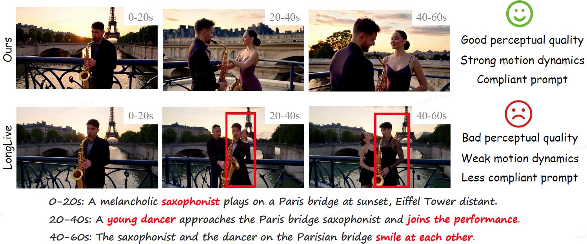

# Anchor Forcing: Anchor Memory and Tri-Region RoPE for Interactive Streaming Video Diffusion

<a href="https://arxiv.org/abs/2603.13405"></a>&nbsp;
<a href="https://vivocameraresearch.github.io/anchorforcing/"></a>&nbsp;
<a href="http://www.apache.org/licenses/LICENSE-2.0"></a><br>


<p>
      📖<strong>TL;DR</strong>: <strong>Anchor Forcing</strong>  enables prompt switches to introduce new subjects and actions while preserving context, motion quality, and temporal coherence; prior methods often degrade over time and miss newly specified interactions.
</p>

## 📢 News
- **[2026-03-18]** 🎉 We have officially released the code for public use!  


## ✅ ToDo List for Any-to-Bokeh Release

- [x] Release the code
- [x] Release the inference pipeline
- [x] Release the training files
- [ ] Release the model weights

## :wrench: Installation
We tested this repo on the following setup:
* Nvidia GPU with at least 40 GB memory (A100 tested).
* Linux operating system.
* 64 GB RAM.

Other hardware setup could also work but hasn't been tested.

**Environment**

Create a conda environment and install dependencies:
```
git clone https://github.com/vivoCameraResearch/Anchor-Forcing.git
cd Anchor-Forcing
conda create -n af python=3.10 -y
conda activate af
pip install torch==2.6.0 torchvision==0.21.0 --index-url https://download.pytorch.org/whl/cu124
pip install -r requirements.txt
pip install flash-attn --no-build-isolation

# Manual installation flash-attention. Recommended version: 2.7.4.post1
https://github.com/Dao-AILab/flash-attention/releases/download/v2.7.4.post1/flash_attn-2.7.4.post1+cu12torch2.6cxx11abiFALSE-cp310-cp310-linux_x86_64.whl
```

## ⏬ Demo Inference 

**Download Wan2.1-T2V-1.3B**
```
huggingface-cli download Wan-AI/Wan2.1-T2V-1.3B --local-dir wan_models/Wan2.1-T2V-1.3B
```

**Download checkpoints**

TODO: The checkpoints is currently under internal review.

**Single Prompt Video Generation**
```
bash inference/inference.sh
```
**Interactive Long Video Generation**
```
bash inference/interactive_inference.py
```


## Training
**Download checkpoints**

Please follow [Self-Forcing](https://github.com/guandeh17/Self-Forcing) to download text prompts and ODE initialized checkpoint.

Download Wan2.1-T2V-14B as the teacher model.

```
huggingface-cli download Wan-AI/Wan2.1-T2V-14B --local-dir wan_models/Wan2.1-T2V-14B
```

**Step1: Self-Forcing Initialization for Short Window and Frame Sink**

Please follow [LongLive](https://nvlabs.github.io/LongLive/docs/#training:~:text=Step1%3A%20Self%2DForcing%20Initialization%20for%20Short%20Window%20and%20Frame%20Sink) 

**Step2: Streaming Long Tuning**
```
bash train.sh
```

**Hints**

This repository only provides the training code for step 2. We default to following the training method of LongLive's step 1. Therefore, you can directly train step 2 using LongLive's checkpoints.

## 📜 Acknowledgement
This codebase builds on [LongLive](https://github.com/NVlabs/LongLive). Thanks for open-sourcing! Besides, we acknowledge following great open-sourcing projects:
- [MemFlow](https://github.com/KlingAIResearch/MemFlow): We followed its interactive video benchmark.
- [Self-Forcing](https://github.com/guandeh17/Self-Forcing): We followed its vbench prompt and checkpoints.


## 🌏 Citation

```bibtex
@article{yang2026anchor,
  title={Anchor Forcing: Anchor Memory and Tri-Region RoPE for Interactive Streaming Video Diffusion},
  author={Yang, Yang and Zhang, Tianyi and Huang, Wei and Chen, Jinwei and Wu, Boxi and He, Xiaofei and Cai, Deng and Li, Bo and Jiang, Peng-Tao},
  journal={arXiv preprint arXiv:2603.13405},
  year={2026}
}
```

## 📧 Contact

If you have any questions and improvement suggestions, please email Yang Yang (yangyang98@zju.edu.cn), or open an issue.
